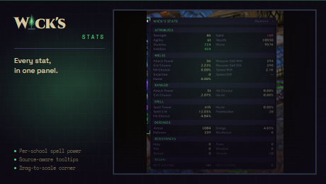

# Wick's Stats

> Detailed character stat panel docked next to the character frame. Tells you what raid buffs you're missing, what your stats would be fully buffed, what's worth on your next gear swap, and how each piece changed your stats live.

A World of Warcraft addon for TBC Classic Anniversary (2.5.5). Surfaces every stat Blizzard buries or hides altogether, layered with stat weights, live gear-swap diffs, and a buff impact preview.

## Features

- **Buff impact preview**: lists missing common raid buffs (Battle Shout, Greater Blessings, Gift of the Wild, Strength of Earth, etc.). An options window lets you tick which buffs to track. A "Simulate raid buffs" toggle previews your fully-buffed stat values for gearing decisions.
- **Live stat diff**: opening the panel baselines your stats. Gear swaps and buff changes tint values bright fel-green if they went up, red if they went down. Hover for the exact delta. Sticky mode persists the baseline across opens and auto-refreshes when your buff set drifts.
- **Stat weights with cap awareness**: top stats ranked per spec. Spell hit drops to 0.00 past the cap. Expertise drops past the dodge cap. Defense rating drops past the uncrittable threshold. Auto-detects spec from your talent tree.
- **Source-aware tooltips**: hover any attribute for a Total / Base+Gear / Buffs / Debuffs breakdown.
- **Smart per-class display**: hides Bonus Healing if you can't heal, Parry and Block if your class can't use them, Mana and Regen for non-mana classes.
- **Snapshots**: named stat captures with chat-window diff, via slash commands.

## Commands

| Command | What it does |
|---|---|
| `/wickstats` or `/wstats` | Toggle the panel |
| `/wickstats snap save <name>` | Capture a stat snapshot |
| `/wickstats snap list` | List saved snapshots |
| `/wickstats snap diff <name>` | Show stat changes vs a snapshot |
| `/wickstats snap rm <name>` | Delete a snapshot |
| `/wickstats spec <name>` | Override the auto-detected spec |
| `/wickstats spec auto` | Re-enable spec auto-detection |

## Suite

<!-- wick:suite-table:start -->
| Addon | GitHub | CurseForge |
|---|---|---|
| **Wick's TBC BIS Tracker** | [repo](https://github.com/Wicksmods/WickidsTBCBISTracker) | [CurseForge](https://www.curseforge.com/wow/addons/wicks-tbc-bis-tracker) |
| **Wick's CD Tracker** | [repo](https://github.com/Wicksmods/WicksCDTracker) | [CurseForge](https://www.curseforge.com/wow/addons/wicks-cd-tracker) |
| **Wick's Trade Hall** | [repo](https://github.com/Wicksmods/WicksTradeHall) | [CurseForge](https://www.curseforge.com/wow/addons/trade-hall) |
| **Wick's Macro Builder** | [repo](https://github.com/Wicksmods/WicksMacroBuilder) | [CurseForge](https://www.curseforge.com/wow/addons/wicks-macro-builder) |
| **Wick's Combat Log** | [repo](https://github.com/Wicksmods/WicksCombatLog) | [CurseForge](https://www.curseforge.com/wow/addons/wicks-combat-log) |
| **Wick's Stats** | [repo](https://github.com/Wicksmods/WicksStats) | [CurseForge](https://www.curseforge.com/wow/addons/wicks-stats) |
| **Wick's Quest Key** | [repo](https://github.com/Wicksmods/WicksQuestKey) | [CurseForge](https://www.curseforge.com/wow/addons/wicks-quest-key) |
| **Wick's Layers** | [repo](https://github.com/Wicksmods/WicksLayers) | [CurseForge](https://www.curseforge.com/wow/addons/wicks-layers) |
| **Wick's Totems and Things** | [repo](https://github.com/Wicksmods/WicksTotemsAndThings) | [CurseForge](https://www.curseforge.com/wow/addons/wicks-totems-and-things) |
| **Wick's Bags** | [repo](https://github.com/Wicksmods/WicksBags) | [CurseForge](https://www.curseforge.com/wow/addons/wicks-bags) |
| **Wick's Travel Form** | [repo](https://github.com/Wicksmods/WicksTravelForm) | [CurseForge](https://www.curseforge.com/wow/addons/wicks-travel-form) |
<!-- wick:suite-table:end -->

## Requirements

TBC Classic Anniversary (2.5.5). Pure Lua, no library dependencies.

## License

MIT, with the Wick brand carve-out described in the suite README.
